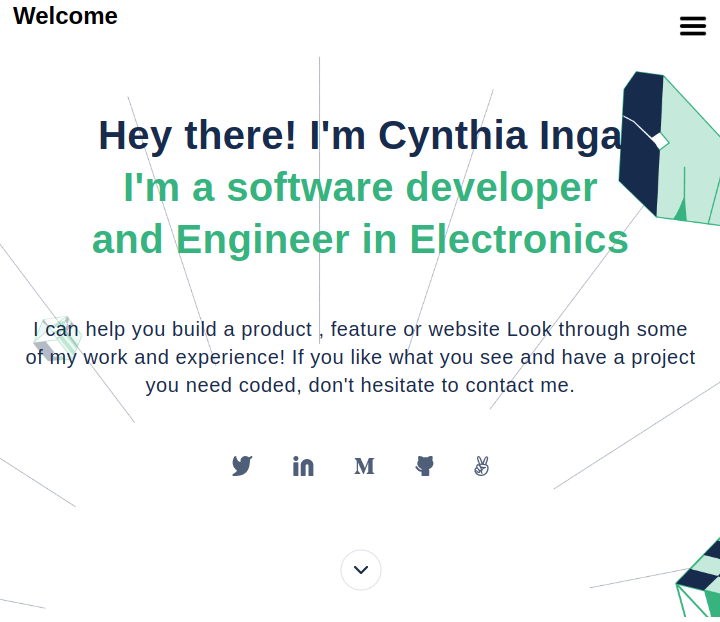
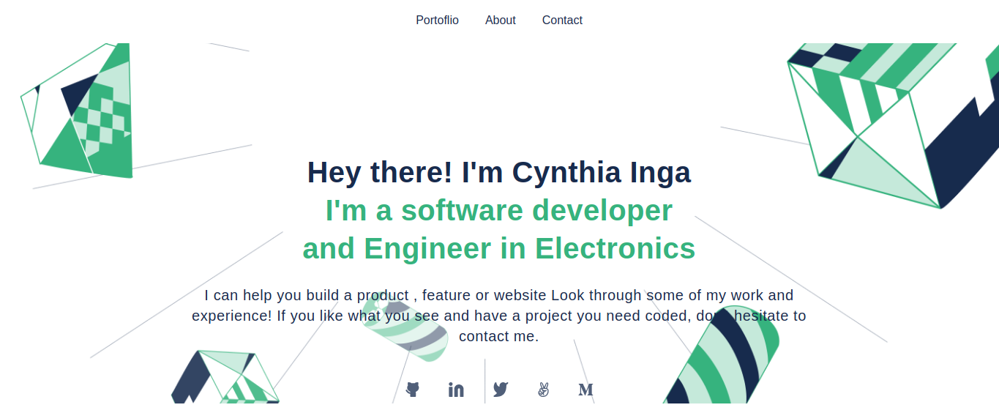

# Personal Portfolio

> This project help to know how to build the portfolio and portfolio is one of the most powerful tools in our software developer toolbox; it’s the easiest way of showing what we’re truly capable of as a developer, and is a quick and simple way for recruiters and hiring managers to get an idea of what we can bring to their teams.

## Description

### Mobile version Screenshot:

### Desktop version Screenshot:

The objectives of this project is to:

- Understand how to parse a Figma design to create a UI.
- Flexbox to place elements in the page.
- Build a personal portfolio site.
- Use images and backgrounds to enhance the look of the website.
- Create forms with HTML5 validations.
- Understand the importance of UX.
- Understand how to create UIs adaptable to different screen sizes using media queries.

## Built With

- HTML
- CSS
- CSS Flexbox

## Live Demo

[Live Demo Link](https://livedemo.com)

## Getting Started

To get a local copy up and running follow these simple example steps.

### Prerequisites

- You need to have git installed in your computer
- A text editor or terminal
- A web browser to view output of your project

### Setup

To clone the repository run the command `git clone https://github.com/cynthiainga/Personal_Portfolio.git`

## Authors

👤 **Cynthia Inga Candy**

- GitHub: [@cynthiainga](https://github.com/cynthiainga)
- Twitter: [@CynthiaInga_C](https://twitter.com/CynthiaInga_C)
- LinkedIn: [Cynthia Inga](https://www.linkedin.com/in/cynthia-inga7/)

## 🤝 Contributing

**Elerqsousy Riz**

GitHub: (https://github.com/Elerqsousy)

Feel free to check the [issues page](../../issues/).

## Show your support

Give a ⭐️ if you like this project!

## Acknowledgments

- Thanks for my coding parters
- Hat tip to Microvers curriculum and all the team
- Hat to Figma for their templates

## 📝 License

This project is [MIT](./MIT.md) licensed.
